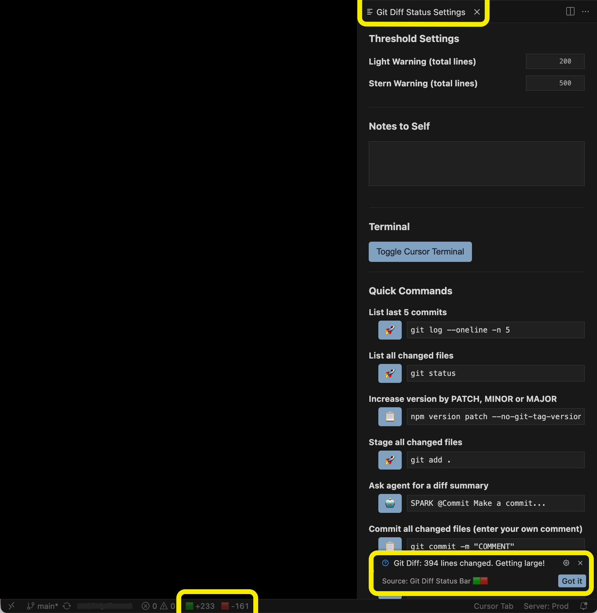

# Git Diff Status Bar 🟩🟥

Super light-weight extension that shows coloured indicators of lines added or removed since last commit. Also warns users if they have made signifciant changes since their last commit.
Built for Cursor but may be useful for other IDEs.

## Features

- Status bar shows coloured counts ( 🟩🟥 ) of lines added and removed in the repo since last commit.
- Clicking opens an interactive settings panel where users can set thresholds for warnings and add custom notes.
- Automated warnings when user passes threshold.
- Panel bar includes rapid terminal templates for common git commands.
- Light-weight.

## License

MIT